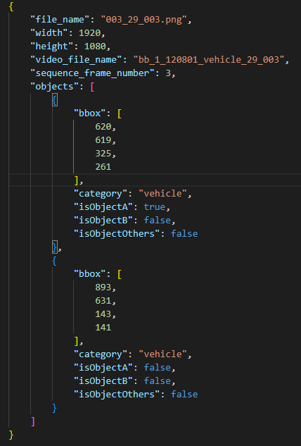
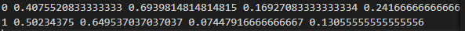

# Car Crash & Object Detection using YOLOv8

## 소개

Car Crash & Object Detection은 블랙박스 카메라의 시점에서 사고를 탐지하는 강력한 감지 시스템을 만드는 것을 목표로 합니다. YOLOv8 모델을 세밀하게 조정하여 사람, 차량 및 이륜차와 같은 다양한 객체를 인식할 수 있도록 훈련되었습니다.

## YOLOv8

YOLOv8 저장소는 [여기](https://github.com/ultralytics/ultralytics)에서 확인할 수 있습니다.

## 환경 설정

1. **conda 가상 환경 생성**
    
    ```bash
    conda create --name tarm python=3.8.16
    conda activate tarm
    ```
    
2. **CUDA 및 cuDNN 설치**
    - CUDA 버전 11.7 설치
    - cuDNN 버전 8.9.0 설치
    
3. **PyTorch 설치**
    
    [PyTorch 한국 사용자 그룹](https://pytorch.kr/get-started/locally/)에서 설치 지침을 참조하세요.
    
    ```bash
    pip install torch torchvision torchaudio --index-url <https://download.pytorch.org/whl/cu121>
    ```
    
4. **YOLOv8 설치**
    
    ```bash
    pip install ultralytics
    ```

### Docker
1. **Docker Build**
    ```bash
    docker build -t tarm:latest .  
    ```
2. **Docker run** 
    - 예측
        ```bash
        docker run -it --name tarm --gpus all <docker_image> bash
        ```
    - 학습
        ```bash
        docker run -it --name tarm --gpus all -v 'local_datasets:/Car-Crash-Object-Detection-using-YOLOv8/datasets' <docker_image> bash
        ```
3. **추가 설정**
    - libglib2.0-dev 설치
        ```bash
        apt-get update
        apt-get install libglib2.0-dev
        ```

## 예측
```bash
python main.py
```


## 모델

모델은 YOLOv8s의 가중치를 사용하여 훈련되었습니다.


## 카테고리 세트

1. accident
2. vehicle
3. pedestrian
4. two-wheeled-vehicle

## 데이터 전처리

- **데이터 파일링**
    
    [AI-Hub](https://www.aihub.or.kr/aihubdata/data/view.do?currMenu=115&topMenu=100&aihubDataSe=data&dataSetSn=597)에서 데이터를 다운로드하세요.
    
    ```bash
    export AIHUB_ID=bbt1250912@gmail.com
    export AIHUB_PW=''
    aihubshell -mode d -datasetkey 597 -filekey 509338
    ```

### 데이터 다운로드 및 폴더 구성

1. **데이터 다운로드**

    - AIHUB에서 필요한 데이터를 포함하는 zip 파일을 다운로드합니다.

2. **데이터 압축 해제**

    - 다운로드한 zip 파일을 압축 해제하고, 해당 폴더를 `download_data` 폴더로 이동합니다.

3. **데이터 폴더 구성**

. **datasets/**

    └── download_data/            # 원본 데이터가 포함된 폴더
        ├── data_file1.zip
        ├── data_file2.zip
    └── origin_data/              # 원본 데이터의 이미지와 레이블이 분리된 폴더
        ├── N_data/
            ├── images/               # 이미지 데이터 폴더
                ├── image1.jpg
                ├── image2.jpg
                ├── ...
            └── labels/               # 레이블 데이터 폴더
                ├── label1.json
                ├── label2.json
    └── yolo_label/
        ├── images/               # yolo 학습용 이미지 폴더
            ├── image1.jpg
            ├── image2.jpg
            ├── ...
        └── labels/               # yolo 학습용 레이블 데이터 폴더
            ├── label1.txt
            ├── label2.txt


### 라벨링 데이터 변환

- datasets/aihub2yolo_label.py 실행
    - 폴더 자동생성
    - 레이블링 데이터 전처리 및 이미지, 레이블 파일 yolo_label 폴더로 이동

1. **레이블링 데이터 전처리**

    - 라벨링된 데이터는 JSON 형식으로 제공됩니다. 이를 YOLO 학습에 적합한 형식으로 변환해야 합니다.

    - 라벨링 데이터를 `convert_label.txt`와 같은 YOLO 형식으로 변환합니다.

    - 라벨링 원본 
    - 

    - YOLO 라벨 변환
    - 

2. **이미지 및 레이블 이동**

    - 이미지와 레이블을 `yolo_label` 폴더로 이동합니다. 여기서 `images` 폴더는 이미지 데이터를, `labels` 폴더는 변환된 레이블 데이터를 저장합니다.

    - datasets/yolo_label/data_label_check.py로 라벨링 체크 가능 

### 데이터 분할 및 학습용 데이터셋 생성

1. **train/val 데이터 분할**

    - `yolov8-vehicle-crash-detection/set_train_val.py`를 실행하여 학습 및 검증 데이터셋을 생성합니다.

2. **데이터셋 구성 파일 수정**

    - `data.yaml` 파일을 수정하여 클래스 수 및 데이터 경로를 지정합니다.

### YOLO 모델 학습

1. **학습 스크립트 실행**

    - `train.py`를 실행하여 YOLO 모델을 학습시킵니다.
    - `continued_train.py`를 실행하여 YOLO 모델을 이어서 학습시킵니다.


## GitHub 버전 관리

| 버전 | 설명 | 날짜 |
| ---- | --- | --- |
| 0.5 | label 변환 기능 및 학습 모델 | 24.04.11|
| 0.6 | 예측 시, mp4로 저장 | 24.04.11|

## 참고 자료

- [YouTube: YOLOv8를 사용한 카 알림 감지](https://www.youtube.com/watch?v=Hk2lGL1_EEg&t=263s)
- [GitHub: yolov8-vehicle-crash-detection](https://github.com/freedomwebtech/yolov8-vehicle-crash-detection/tree/main)
- [GitHub: 사고 감지 모델](https://github.com/shubhankar-shandilya-india/Accident-Detection-Model/tree/master)
- [YouTube: 사용자 정의 데이터로 YOLOv8 훈련하기](https://www.youtube.com/watch?v=em_lOAp8DJE)
- [YouTube: 사용자 정의 데이터로 YOLOv5 훈련하기](https://www.youtube.com/watch?v=T0DO1C8uYP8)
